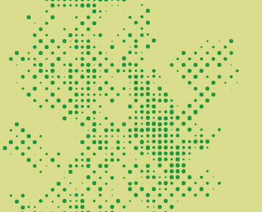

# memo
Random walk and vector.

Reference: Nature of code by Daniel Shiffman
[chp00_introduction/NOC_I_01_RandomWalkTraditional/sketch.js](https://github.com/nature-of-code/noc-examples-p5.js/blob/master/chp00_introduction/NOC_I_01_RandomWalkTraditional/sketch.js)

